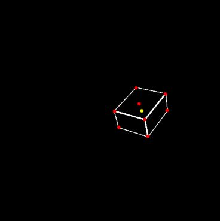

# Generating wireframes
- A tool capable of generating wireframe model images on a large scale, and saving their annotations. 
- With these wireframes, we can generate controlled stable diffusion images.
- These synthetic images can then be utilized for fine-tuning our model.

# Controls

There are two ways of using this tool: manually and automatically.

To choose manual mode, type "y" and press Enter.

## Manual Controls

- Enter: Generates a new wireframe with a different height, depth, and width.
- Right-arrow-key: Randomly rotates/translates the current wireframe, takes a screenshot, and writes annotations to a CSV file.
- Key a: Enables drawing the axis.
- Key s: Enables taking screenshots.

## Automatic Controls

- Specify the number of wireframes you want to generate.
- Define how screenshots should be taken for these wireframes in different positions.

# Running the tool

This sofware was created on Windows using Python 3.11.6.
